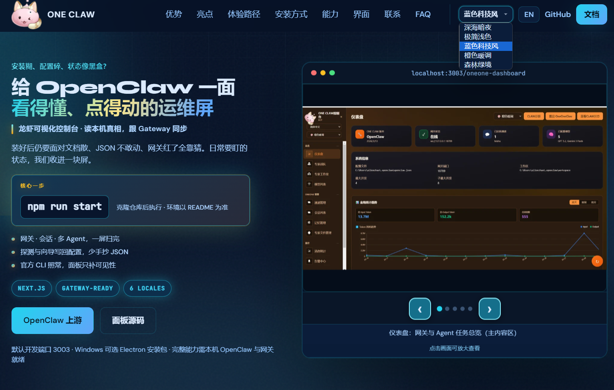
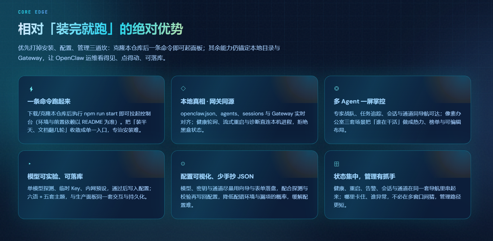
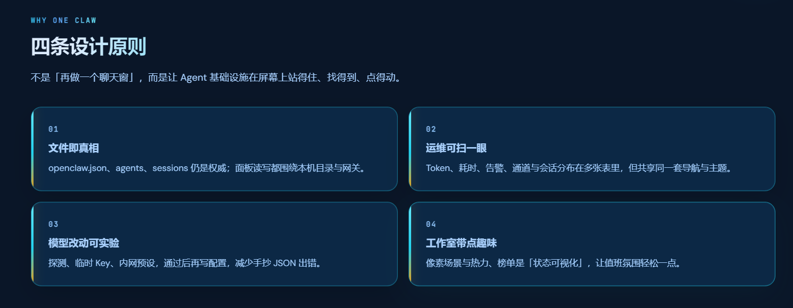
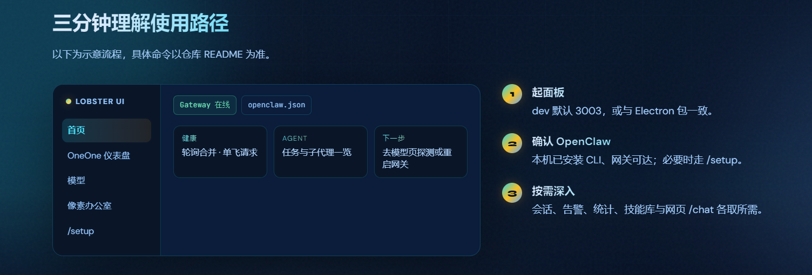
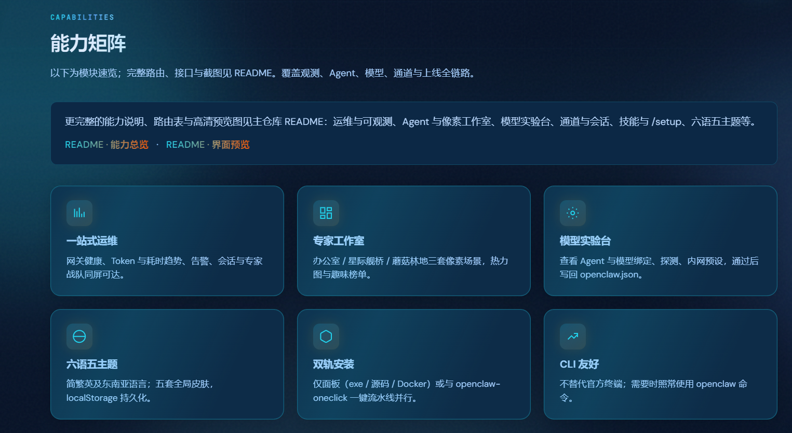
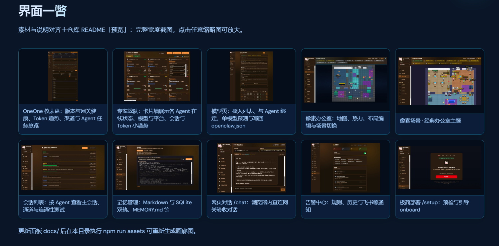
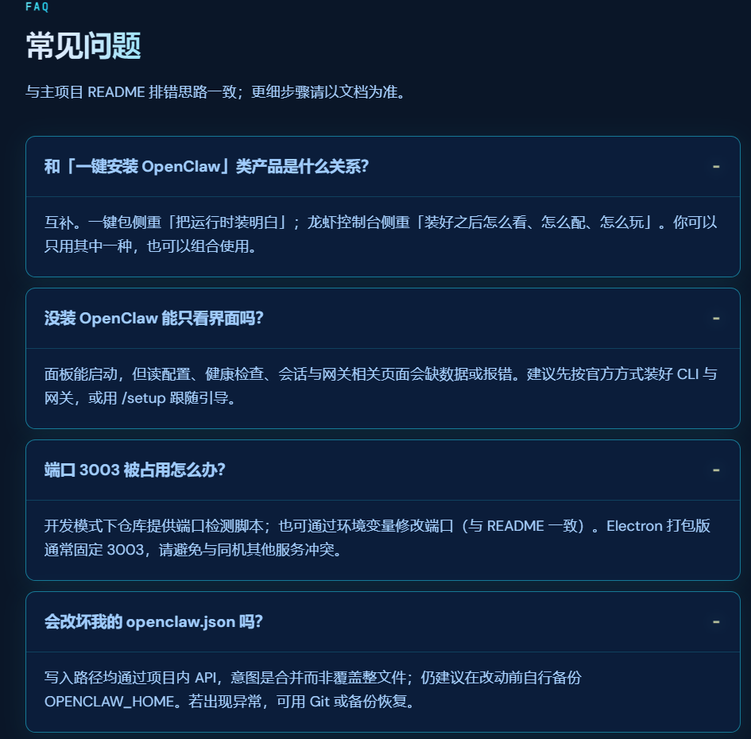
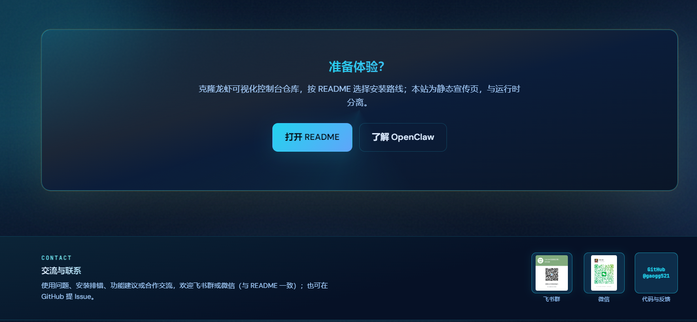

# ONE CLAW · 龙虾可视化控制台 — 宣传站

**Static marketing site for the Lobster OpenClaw control panel** — Vite + vanilla HTML/CSS/JS, bilingual (ZH/EN), deployable to any static host.

| 本仓库（独立） | 面板主仓库 | OpenClaw |
|----------------|------------|----------|
| [gaogg521/website-display](https://github.com/gaogg521/website-display) | [gaogg521-openclaw-Visual-Control-Panel](https://github.com/gaogg521/gaogg521-openclaw-Visual-Control-Panel) | [openclaw/openclaw](https://github.com/openclaw/openclaw) |

**克隆（SSH）**

```bash
git clone git@github.com:gaogg521/website-display.git
cd website-display
```

**克隆（HTTPS）**

```bash
git clone https://github.com/gaogg521/website-display.git
cd website-display
```

---

## 我们解决的是哪一类问题？

市面上已有优秀的「**一键安装 / 桌面壳**」帮你把 OpenClaw **跑起来**；**龙虾控制台**专注另一件事：

为 OpenClaw 提供 **AI 时代运维台** —— **盯网关与 Token**、**看 Agent 与会话**、**实验模型写回配置**、**逛像素孪生工作室**，一切锚定 **本机目录与 Gateway**。

它不替代官方 CLI，也不与「装好环境」类产品抢赛道；它解决的是 **装好之后**：配置散、状态黑盒、多 Agent 难扫、改模型怕手抄 JSON 等 **日常运维与可观测** 问题。

---

## 界面预览（8 张）

以下截图为本仓库 **静态宣传站**（`index.html` 单页）各区块的真实效果，顺序与页内锚点 **`#edge` / `#highlights` / `#flow` …** 及 `src/main.js` 中 `STRINGS` 文案一致；**并非**把面板应用每一页单独截一张。图片放在 **`image/1.png`～`8.png`**（见 [`image/README.md`](./image/README.md)）。

### 1. 首屏（Hero）— 痛点叙事 · `npm run start` · 轮播仪表盘预览

对应页面 **`#main` 内 `.hero`**：眉标「安装糊、配置碎、状态像黑盒？」、双行主标题、**核心一步** 命令块与三条要点，右侧为浏览器框内 **首页轮播**（当前帧为 **OneOne 仪表盘**：版本/网关/会话/模型与 Token 趋势等），与 `carousel.cap1` 说明一致。顶栏可见主题下拉（如「蓝色科技风」）与 **文档 / 面板源码** 入口。



### 2. 核心优势（CORE EDGE）— `#edge` · 六大绝对优势

对应 **`section#edge`**：`edge.kicker` **CORE EDGE**、标题「相对『装完就跑』的绝对优势」及 **6 张卡片**（一条命令跑起来、本地真相·网关同源、多 Agent 一屏掌控、模型可实验可落库、配置可视化少手抄 JSON、状态集中管理有抓手），与 `edge.p1`–`edge.p6` 文案一致。



### 3. 设计原则（WHY ONE CLAW）— `#highlights` · 四条原则

对应 **`section#highlights`**：`highlights.kicker`、标题「四条设计原则」及 **01–04** 四宫格（文件即真相、运维可扫一眼、模型改动可实验、工作室带点趣味），对应 `highlights.h1`–`h4`。



### 4. 体验路径（FLOW）— `#flow` · 示意 UI 与三步说明

对应 **`section#flow`**：`flow.kicker` **FLOW**、标题「三分钟理解使用路径」；左侧 **Lobster UI** 线框（侧栏：首页、OneOne 仪表盘、模型、像素办公室、`/setup`；主区 Gateway 在线、`openclaw.json`、健康/Agent/下一步卡片），右侧 **`flow.s1`–`s3`**（起面板 → 确认 OpenClaw → 按需深入）。



### 5. 能力矩阵（CAPABILITIES）— `#features` · 六格能力卡

对应 **`section#features`**：`features.kicker` **CAPABILITIES**、标题「能力矩阵」、导语与 **README · 能力总览 / 界面预览** 链接；下方六卡为 **一站式运维、专家工作室、模型实验台、六语五主题、双轨安装、CLI 友好**，与 `features.f1`–`f6` 一致。



### 6. 界面一瞥（SCREEN）— `#gallery` · 十缩略图画廊

对应 **`section#gallery`**：`gallery.kicker` **SCREEN**、标题「界面一瞥」；**两行共 10 张**产品界面缩略图（仪表盘、专家战队、模型页、像素办公室、像素场景、会话列表、记忆、网页 `/chat`、告警、`/setup` 等），说明与主仓 README「预览」对齐，缩略图可点击灯箱放大（`gallery.c1`–`c10`）。



### 7. 常见问题（FAQ）— `#faq` · 折叠问答

对应 **`section#faq`**：`faq.kicker` **FAQ**、标题「常见问题」；可见与 **一键安装类产品关系**、无 OpenClaw 能否空跑界面、**3003 端口**占用、`openclaw.json` **合并写入与备份** 等条目，与 `faq.q1`–`q4` 一致。



### 8. 准备体验（CTA）与联系（CONTACT）— `#start` + `#contact`

上块对应 **`section#start`**：`start.title`「准备体验？」、静态站与运行时分离说明、**打开 README** / **了解 OpenClaw** 按钮。下块为 **`footer#contact`**：`contact.kicker` **CONTACT**、「交流与联系」、飞书/微信二维码与 **GitHub @gaogg521 · 代码与反馈**。



---

## 简介

本仓库 **[website-display](https://github.com/gaogg521/website-display)** 与 **[龙虾可视化控制台](https://github.com/gaogg521/gaogg521-openclaw-Visual-Control-Panel)** 的 Git **相互独立**，仅通过站内链接指向面板 README / 源码。仓库根目录即为 Vite 项目（不要把整个 monorepo 再套一层 `www/` 再推送，除非你刻意用子目录托管）。

静态站点包含：首屏叙事与 `npm run start` 引导、定位说明、核心优势、设计原则、体验路径示意、安装方式、能力矩阵、截图轮播与画廊（灯箱）、FAQ、联系区（飞书 / 微信二维码）等；**上文的 8 张图为本 README 专用展示**，与构建流程中的 `carousel-sources/`、`npm run assets` 无强制关联。

- **构建产物**：`dist/`，可整包作为网站根目录发布。
- **`vite.config.js`** 中 `base: "./"`，适合 **GitHub Pages**、子路径与 CDN。

---

## 环境要求

- **Node.js** ≥ 18（推荐当前 LTS）
- **npm** 或兼容包管理器

---

## 快速开始

```bash
npm install
npm run assets   # 品牌图、轮播、画廊、联系区（详见下文）
npm run dev      # http://localhost:5173
```

生产构建：

```bash
npm run build    # 等价于 npm run assets && vite build
```

本地预览构建结果：

```bash
npm run preview
```

---

## 配置

编辑 **`src/site.config.js`**：

| 字段 | 说明 |
|------|------|
| `repoUrl` | **面板** Git 仓库根 URL；顶栏/页脚「面板源码」「文档」等指向 **龙虾控制台**，不是本宣传站仓库。 |
| `readmeUrl` | 可选。留空则文档按钮为 `${repoUrl}/blob/main/README.md`。 |
| `openclawUrl` | OpenClaw 官方仓库。 |
| `panelPort` | 文案中的默认端口（如 `3003`）。 |
| `authorGithub` | 作者 GitHub 主页。 |

---

## 静态资源与 `npm run assets`

脚本：**`scripts/build-assets.mjs`**（`sharp`）。

1. **品牌图**：若本机在与本仓库**同级**目录下克隆了面板仓库，且存在 `../龙虾可视化控制面板/public/brand-mark.png`，会复制到 `public/brand-mark.png` 并同步 `public/logo.png`。**仅本仓库时**：请自行放入 `public/brand-mark.png`（及可选 `logo.png`）。
2. **首页轮播**：优先使用本仓库 **`carousel-sources/`** 内 PNG（见脚本 `CAROUSEL_SLIDES`）→ `public/carousel/slide-XX.webp` 与 `carousel-manifest.json`。勿把大源图只堆在 `public/`。
3. **画廊与联系区二维码**：脚本会尝试读取 **`../龙虾可视化控制面板/docs/`** 中约定文件名。若独立开发无此路径，可手动维护 `public/gallery/`、`public/contact/`，或与面板仓并列克隆后本地执行一次 `npm run assets` 再提交生成结果。

轮播说明文案对应 **`src/main.js`** 的 `carousel.cap1`–`cap5`（中英 `STRINGS`）。

---

## 部署示例

| 平台 | 说明 |
|------|------|
| **GitHub Pages** | `npm run build` 后部署 `dist`；Pages 指向 `gh-pages` 或 Actions 产物。`base: "./"` 已适配。 |
| **Cloudflare Pages** | Build: `npm run build`，Output: `dist`。 |
| **Nginx / CDN** | 以 `dist` 为站点根目录。 |

---

## 目录结构（仓库根）

```
.
├── index.html
├── image/                  # README 用 8 张截图（1.png～8.png，见 image/README.md）
├── public/
├── carousel-sources/       # 轮播源图（大文件可按需 .gitignore）
├── scripts/
│   └── build-assets.mjs
├── src/
│   ├── main.js
│   ├── style.css
│   ├── tech-enhancements.css
│   └── site.config.js
├── vite.config.js
├── package.json
└── README.md
```

---

## 功能说明（维护）

- **语言**：右上角 EN / 中文 → `localStorage` `www-lang`。
- **主题**：五套 `data-theme` → `www-theme`。
- **首屏 Logo**：可拖拽，姿态 `www-brand-logo-pose`。
- **灯箱**：轮播、画廊、页脚二维码点击放大。

---

## 与面板仓库的关系

| 仓库 | 职责 |
|------|------|
| **website-display**（本仓库） | 静态宣传页源码与构建 |
| **gaogg521-openclaw-Visual-Control-Panel** | Next.js 面板、安装与 API 以该仓 **README** 为准 |

站内按钮「面板源码 / 文档」仍指向面板仓库；**本仓库**仅托管展示站点。

---

## 许可证

请在本仓库根目录放置 `LICENSE`（可与面板仓一致或单独声明），并在此更新一句说明。

---

## 维护者

[@gaogg521](https://github.com/gaogg521)
